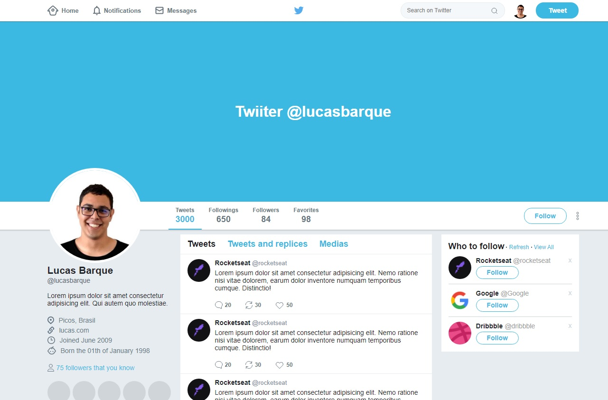

<!-- Logotipo -->
<div align="center">
  
</div>

<!-- Title -->
<h1 align="center"> Twitter </h1>

<!-- Sobre o Projeto -->

## 🧐 Sobre o Projeto

Layout construído com HTML + CSS, aplicando conceitos de flexbox.

## 🚀 Tecnologias e Bibliotecas

- HTML
- CSS

## 💻 Rodando o Projeto

```
# Abra um terminal e copie este repositório com o comando
$ git clone https://github.com/lucasbarque/TwitterFlexbox.git

# Acesse a pasta da aplicação
$ cd TwitterFlexbox

# Abra o arquivo index.html em seu navegador

```
